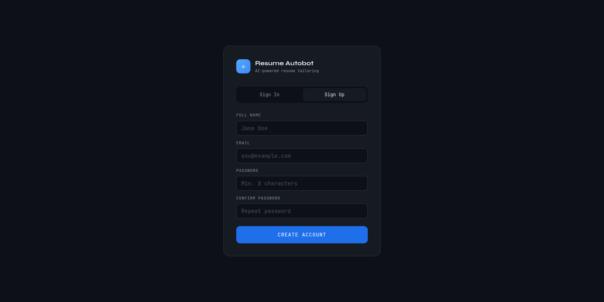
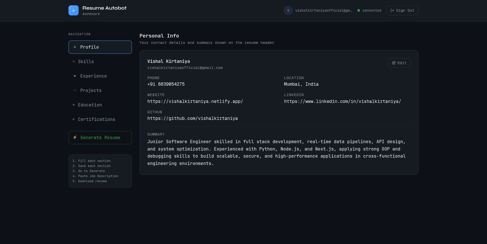
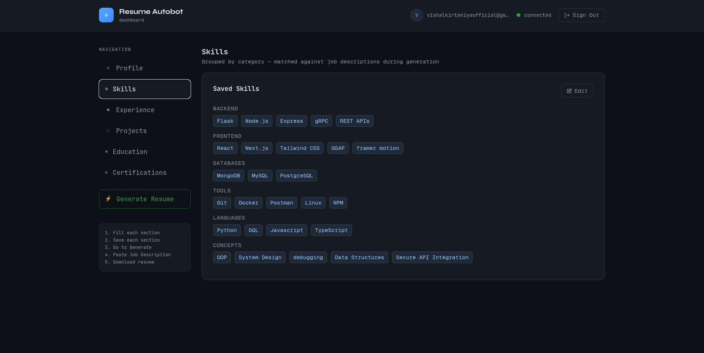
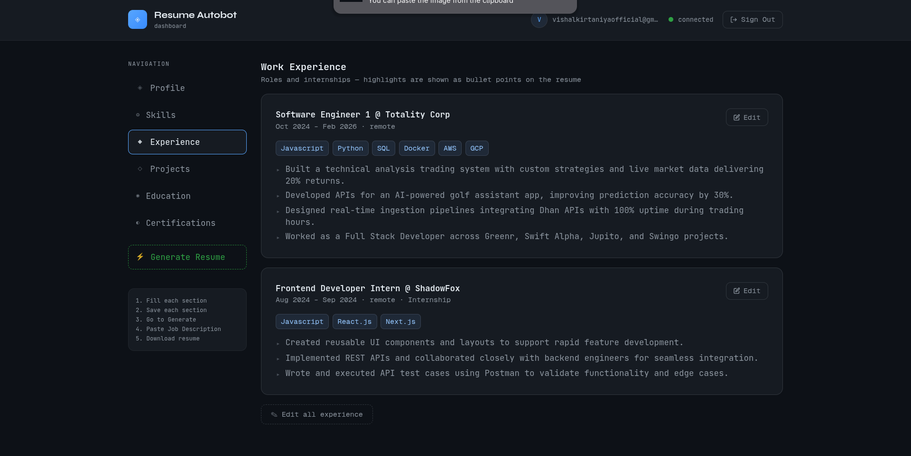
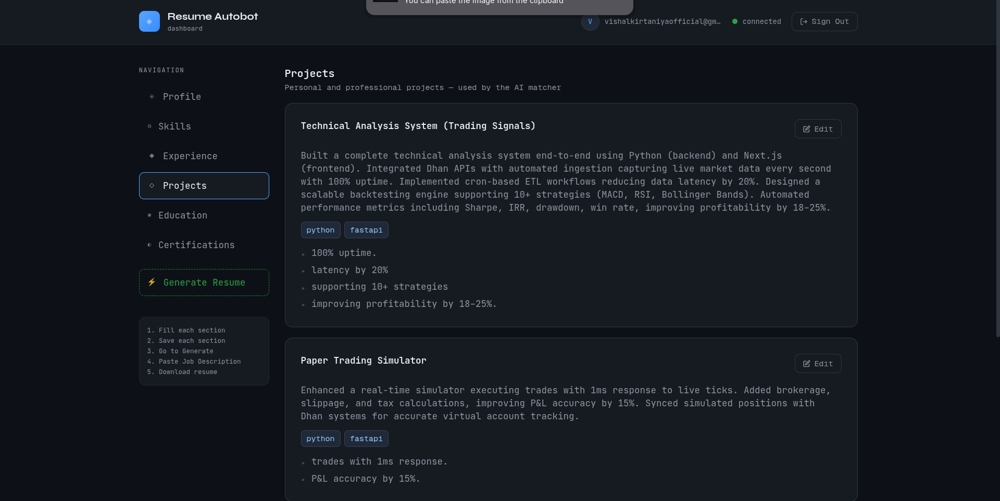
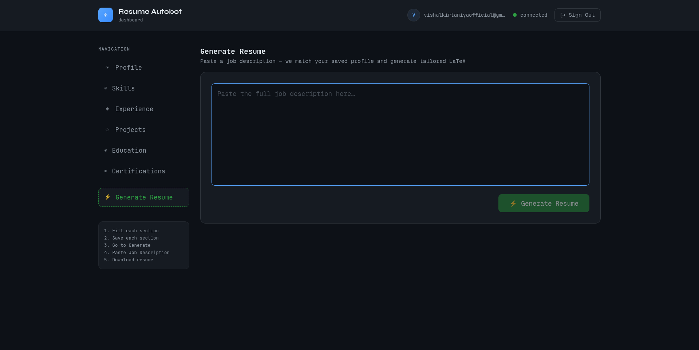
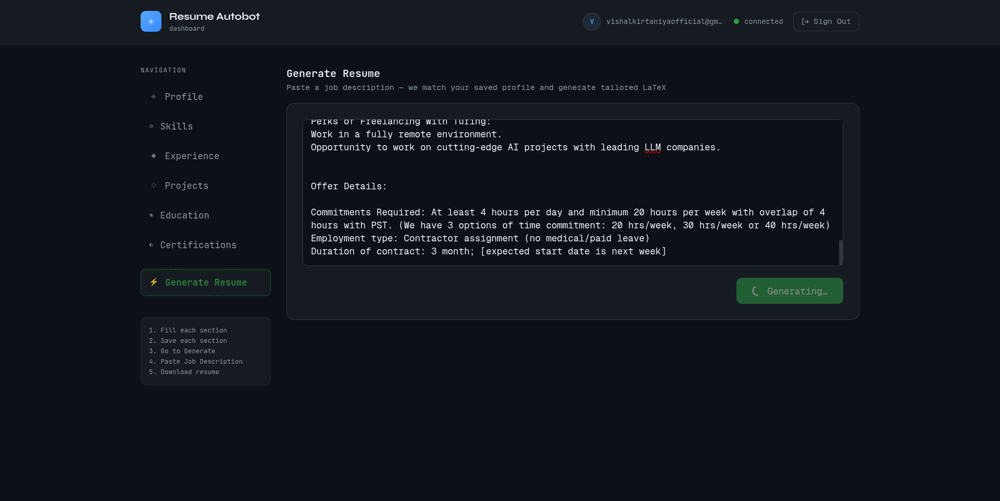
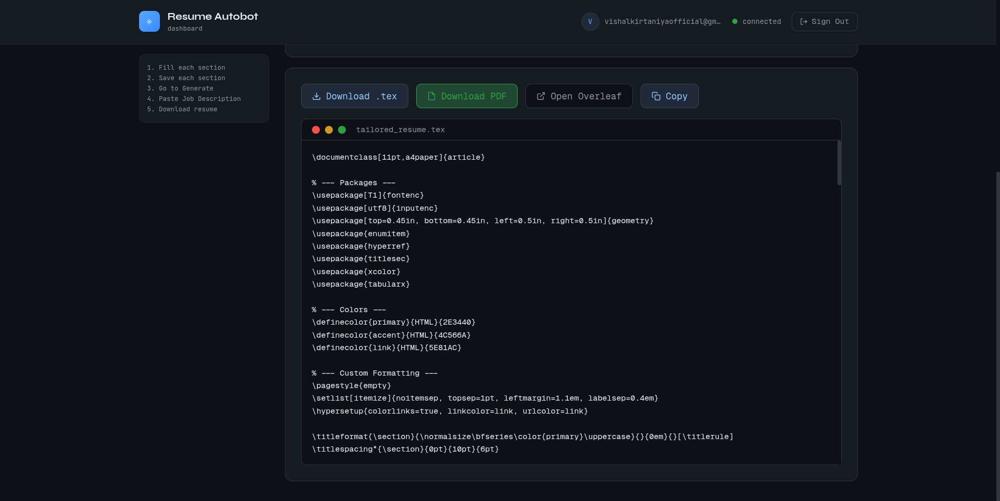

<div align="center">

# Resume Autobot — Frontend

**AI-powered resume tailoring dashboard built with Next.js**

[](https://nextjs.org/)
[](https://react.dev/)
[](https://www.typescriptlang.org/)
[](https://tailwindcss.com/)
[](https://www.docker.com/)

**[Live Demo](http://43.205.211.233:3000)**

</div>

---

## What is Resume Autobot?

Resume Autobot is a full-stack AI-powered resume builder that tailors your resume to any job description in seconds. Paste a job description, and the app uses Groq LLM to extract the job title, rewrite your summary, match your skills, and generate LaTeX bullet points for your projects — then compiles a downloadable PDF.

---

## Screenshots

### Sign Up / Sign In


### Profile — Personal Info


### Skills


### Work Experience


### Projects


### Generate Resume


### Paste Job Description


### Download Resume


---

## Tech Stack

| Layer | Technology |
|---|---|
| Framework | Next.js 16 (App Router) |
| Language | TypeScript |
| Styling | Tailwind CSS v4 |
| Auth | Supabase JWT (via backend) |
| State | React hooks |
| Deployment | Docker + AWS EC2 |

---

## Project Structure

```
resume-frontend/
├── app/
│   └── page.tsx
├── components/
│   ├── pages/
│   │   ├── ProfileTab.tsx
│   │   ├── SkillsTab.tsx
│   │   ├── ExperienceTab.tsx
│   │   ├── ProjectsTab.tsx
│   │   ├── EducationTab.tsx
│   │   ├── CertificationTab.tsx
│   │   └── GenerateTab.tsx
│   ├── SharedUi.tsx
│   ├── ButtonComponents.tsx
│   ├── ViewCard.tsx
│   ├── CardHeader.tsx
│   ├── LoadingCard.tsx
│   ├── EmptyState.tsx
│   ├── Field.tsx
│   └── SectionTitle.tsx
├── lib/
│   ├── apiFetch.ts
│   └── config.ts
├── types/
│   └── type.ts
├── public/
├── Dockerfile
├── next.config.ts
└── package.json
```

---

## Features

- **Auth flow** — Sign up, sign in, session expiry modal with automatic token refresh
- **Profile dashboard** — 6 sections: Profile, Skills, Experience, Projects, Education, Certifications
- **AI resume generation** — Paste any job description and get a tailored resume in seconds
- **LaTeX output** — View generated `.tex` code with syntax highlighting
- **Download options** — Download as `.tex`, compile and download as PDF, or open in Overleaf

---

## Getting Started

### Prerequisites

- Node.js 22+
- npm
- Backend running at a reachable URL (see [backend repo](https://github.com/vishalkirtaniya/custom-resume-backend))

### Local Development

```bash
# Clone the repo
git clone https://github.com/vishalkirtaniya/custom-resume-frontend.git
cd custom-resume-frontend

# Install dependencies
npm install

# Create environment file
cp .env.example .env.local
```

Edit `.env.local`:
```env
NEXT_PUBLIC_API_URL=http://localhost:8000
```

```bash
# Start the dev server
npm run dev
```

Open [http://localhost:3000](http://localhost:3000).

---

## Docker

### Build and run standalone

```bash
docker build \
  --build-arg NEXT_PUBLIC_API_URL=http://your-backend-url:8000 \
  -t resume-frontend .

docker run -p 3000:3000 resume-frontend
```

### With Docker Compose (recommended)

See the [root docker-compose.yml](https://github.com/vishalkirtaniya/custom-resume-backend) for running frontend + backend together.

```bash
docker compose up --build -d
```

---

## Environment Variables

| Variable | Description | Example |
|---|---|---|
| `NEXT_PUBLIC_API_URL` | Backend API base URL (build-time) | `http://43.205.211.233:8000` |

> **Note:** `NEXT_PUBLIC_*` variables are baked into the JS bundle at build time. If you change the API URL, you must rebuild the Docker image.

---

## Deployment

This project is deployed on **AWS EC2 t3.small** in the **ap-south-1 (Mumbai)** region using Docker.

```bash
# On your server
git clone https://github.com/vishalkirtaniya/custom-resume-frontend.git
cd custom-resume-frontend

docker build \
  --build-arg NEXT_PUBLIC_API_URL=http://YOUR_SERVER_IP:8000 \
  -t resume-frontend .

docker run -d -p 3000:3000 --restart unless-stopped resume-frontend
```

Live at: **[http://43.205.211.233:3000](http://43.205.211.233:3000)**

---

## Related

- **Backend repo:** [custom-resume-backend](https://github.com/vishalkirtaniya/custom-resume-backend)

---

<div align="center">
Made by <a href="https://github.com/vishalkirtaniya">Vishal Kirtaniya</a>
</div>